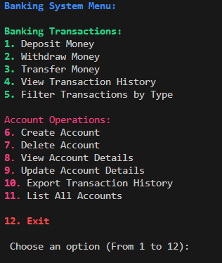
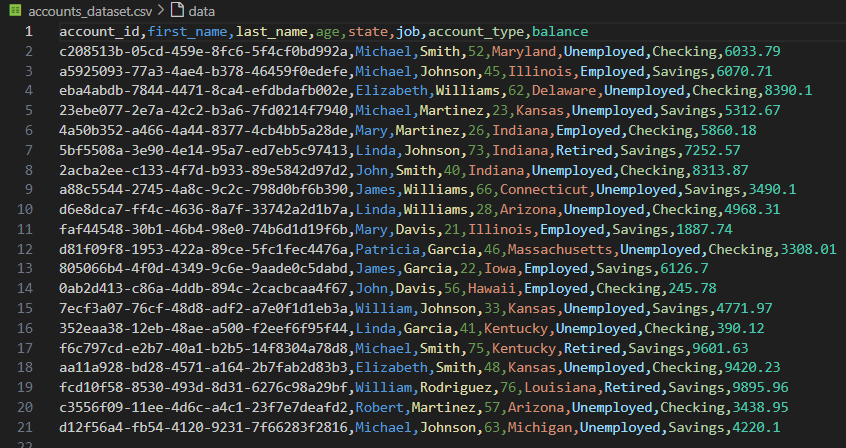
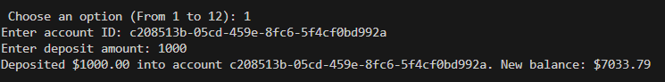
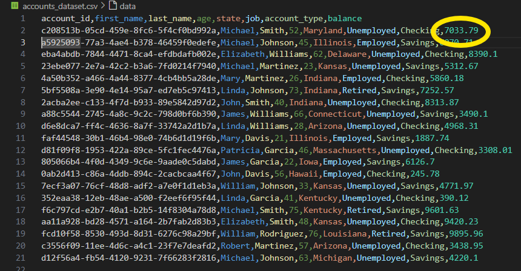

# Project Overview 🔍
## Commits Authors 👨‍💻
- <span style="color:#23b9f0;">"privat"</span> and <span style="color:#23b9f0;">"MMS0407"</span> commits belong to **Mohamed Malek Sfar**
- <span style="color:#23b9f0;">"arshiashams"</span> commits belong to **Arshia Shams**
- <span style="color:#23b9f0;">"linusmfs"</span> commits belong to **Linus Molin**

## 1. Purpose 🎯
This project is a Python-based banking system designed to manage and perform basic banking operations such as creating accounts, depositing money, withdrawing money, transferring funds, and viewing transaction history. 
It includes a customized command-line interface (CLI) to interact with the system, and the backend is organized into modules that handle the various banking functions.
## 2. Demonstration 🖥️
After running the main.py file, a command line interface appears on the console allowing the user to choose from a variety of options, as shown in the screenshot below, while in the background, a dataset called "accounts_dataset" in a csv format is being created.

### Dataset
The dataset contains information regarding 20 accounts that are generated randomly when you first run the code. Each account has:
- **account_id**: generated using Python's uuid.uuid4() function, which produces a unique universally random identifier, ensuring that each account receives a distinct and non-repeating ID.
- **first_name**: chosen randomly from a list of first names
- **last_name**: chosen randomly from a list of last names
- **age**: chosen randomly from 18 to 80
- **state**: chosen randomly from a list of states
- **job**: either employed, unemployed or retired in case age is above 67
- **account_type**: Checkings or Savings
- **balance**: chosen randomly between 100 and 10000 USD

**Command Line Interface screenshot**: 



**accounts_dataset example**:




Any change performed on the accounts would lead into the accounts_datset file being updated automatically, as this acts as the bank's internal database. For example, let's deposit 1000 USD to the first account (1st row) belonging to **Michael Smith** , which had 6033.79 USD in his balance. 

For this, we need to:
- Choose **Option 1**
- Copy the appropriate account_id from the accounts_dataset
- Type the amount to be deposited
- Receive confirmation message 



As a result, going back to the accounts_dataset, we can see that his balance increased by 1000 USD, resulting in 7033.79 USD.



The same applies for the other operations.

## 3. How to Start the Code 🔧

First, ensure you have Python installed on your system. Then install the necessary package by running:

```bash
pip install rich==13.9.4
```

### Running the Application

After installing the required packages, start the application with the following command:

```bash
python3 -m main.py
```

This will launch the CLI where you can interact with the banking system. The CLI provides clear instructions on how to navigate and use the program.

### Architecture

-   **Modular Design**: The code is organized into separate modules corresponding to each major component such as accounts, transactions, and the banking CLI.
-   **External Libraries**: We utilized `rich` for its capabilities in creating enhanced and customizable CLI experiences, providing an engaging and interactive user interface.

## 4. Structure
The key files are:
- **banking_system_components/**: This is the core of the project. It contains Python modules for different components of the banking system.
- **tests/**: Contains unit tests for the different components of the system. Each module (Account, Bank, Transaction) has its respective test file to ensure that the functionality works correctly.
- **main.py**: The main script to launch the command-line interface (CLI) and interact with the banking system.

Overall, the project is organized into the following directories and files:
```
├── assets/                          # Contains asset files such as images
│   ├── accounts_dataset_example.png  # Example of an accounts dataset
│   ├── cli_operation.png            # Example of a CLI operation screenshot
│   ├── command_line_interface.png   # Screenshot of the CLI
│   └── coverage_report.png          # Code coverage report
├── banking_system_components/       # Core logic of the banking system
│   ├── __pycache__/                 
│   ├── __init__.py                 
│   ├── account.py                   # Defines the Account class and related methods
│   ├── bank.py                      # Manages overall bank operations
│   ├── command_line_interface.py    # Implements and customizes the CLI
│   └── transaction.py               # Handles transactions like deposits and withdrawals
├── tests/                           # Contains unit test files for the project
│   ├── __init__.py                  
│   ├── account_test.py              # Unit tests for the Account class
│   ├── bank_test.py                 # Unit tests for the Bank class
│   └── transaction_test.py          # Unit tests for transactions
├── .gitignore                       # Git ignore file to exclude unnecessary files
├── accounts_dataset.csv             # dataset automatically generated
├── main.py                          # Main entry point to run the CLI
├── README.md                        # Project documentation
└── .git/                            # Git configuration directory
```


## 5. Testing 🛠️

Testing was a critical part of our development process, ensuring the reliability and functionality of the application through various methods.

### Unit Testing

We have developed comprehensive unit tests for each component.

-   Run tests with:

```bash
python3 -m coverage run -m unittest discover -s . -p '*_test.py'
```

### Integration Testing

Integration tests were developed to ensure that different parts of the application work together seamlessly.

### Coverage Reporting

> :warning: **Important**: Run the testes before trying to load the coverage report!

To view the test coverage report, run:

```bash
python3 -m coverage report
```

This command helps identify any parts of the codebase that may need additional testing to ensure comprehensive coverage.

-   Our Coverage Report
    
